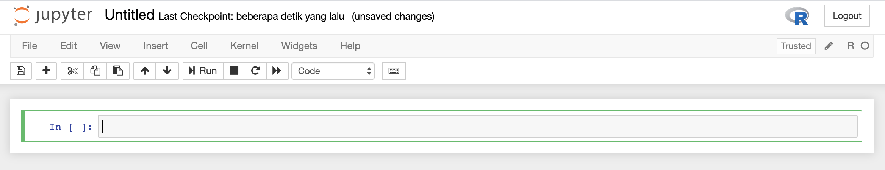

# Time Series Analysis 

Documentation of Time Series Analysis Course 2020 by
* 05111950010029 - Yolla Faradhilla
* 05111950010040 - Hafara Firdausi
  

## Assignments
1. ARIMA - Paper Review
2. RNN for Timeseries
    * [Forecasting Price of Chicken](rnn/price_of_chicken.R)
3. LSTM for Timeseries
    * [Predicting Eye Movements](LSTM/eye-movements.ipynb)
    * [Forecasting Electrocardiogram Activity](LSTM/ecg.R)
4. GSTAR
    * [Predicting Temperature in Surabaya](GSTAR/gstar-temperatur.r)
   

## Tools

* R
* RStudio (maybe you use this)
* Jupyter Notebook (I prefer this!)

### Configure Jupyter Notebook to work with R on a Mac
I'm totally new in the R language and not comfortable using RStudio. So, I looked for other alternatives that could make me having fun with R. And yeah, I end up using Jupyter Notebook right now! xoxo, thanks jupyter :sparkling_heart:

1. Open your terminal, install `libgit2` using brew
    ```bash
    $ brew install libgit2
    ```
2. Open R within terminal
    ```bash
    $ R
    ```
3. Install these R libraries
    ```R
    > install.packages(c(
      'repr',
      'IRdisplay',
      'evaluate',
      'crayon',
      'pbdZMQ',
      'devtools',
      'uuid',
      'digest',
      'git2r'
      ), dependencies = TRUE)
    ```

4. Install IRkernel package from Github using `devtools::install_github`
    ```R
    > devtools::install_github('IRkernel/IRkernel')
    ```
5. Install the Interactive R kernel system-wide
   ```R
    > IRkernel::installspec(user = FALSE)
    ```
6. Done! Open your Jupyter Notebook and let's have fun!
    ```bash
    $ jupyter notebook
    ```
    


## References
* N.D. Lewis - Neural Networks for Time Series Forecasting with R (2017)
* William W.S.Wei - Time Series Analysis (2006)
